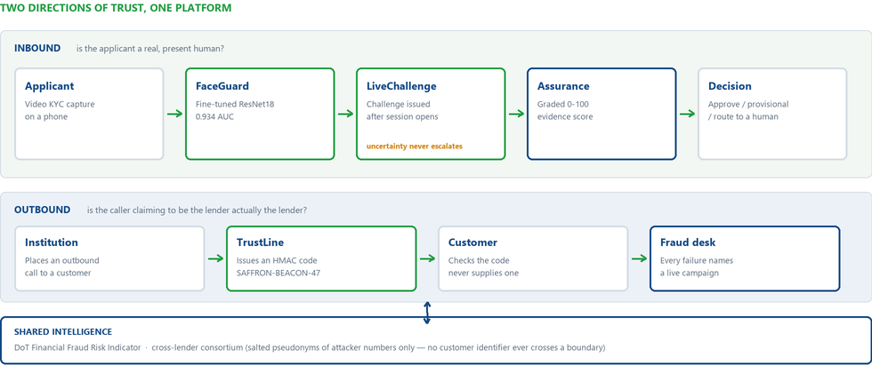
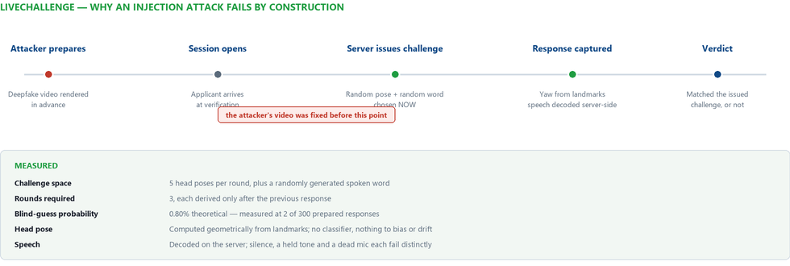
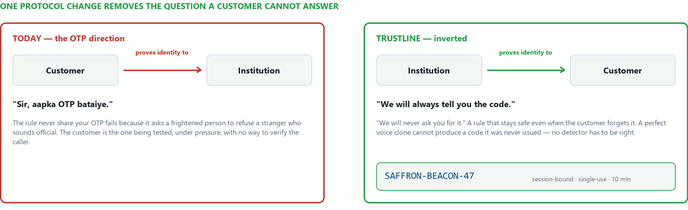
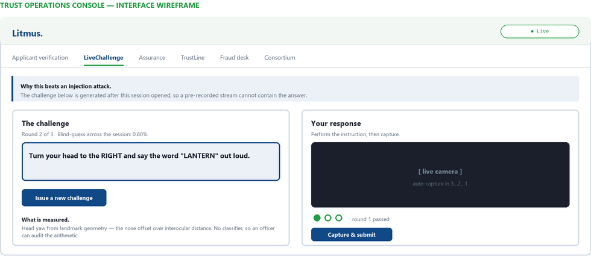

<div align="center">

# Litmus

**A two-way AI trust layer for lending.**

*Every fake has a tell. We read it before the loan does.*

TVS Credit E.P.I.C 8.0 — IT Challenge · Problem Statement (b): Decoding Machine-Generated Trust

**[▶ Open the live console](https://yea-rat-tagged-wages.trycloudflare.com/console)** · [Presentation script](PRESENTATION_SCRIPT.md) · [Deployment](DEPLOYMENT.md)

`FastAPI` · `React 19` · `PyTorch` · `HMAC-SHA256` · Deployed on AWS EC2 · 375 MB resident

</div>

---

## The finding this product is built around

Before writing a line of product code, we benchmarked four public deepfake
detectors — the same class of model this industry sells to banks.

| Test condition | Result |
|---|---|
| Real human speech | 80% correctly approved |
| 2019-era synthetic speech | 35% caught |
| **Modern neural TTS** | **0% caught** |
| Face detection, best public baseline | 0.652 AUC |
| Face detection, **our fine-tune** | **0.934 AUC** |

Zero. Both models, confidently wrong, every single sample.

**So Litmus never asks a detector to be right forever.** It asks for evidence a
forgery cannot manufacture — a code a clone was never issued, a physical
challenge chosen after the attacker's video was made — and routes everything
uncertain to a human rather than to a rejection.

---

## Architecture

Two directions of trust. The industry guards one.



**Inbound** — is the applicant a real, present human? Solved by every KYC
vendor, and still fragile: detectors decay against each new generator, and an
uncertain result on an under-represented face becomes the rejection of a
genuine customer.

**Outbound** — is the caller claiming to be the lender actually the lender?
Almost nobody guards this, because a KYC vendor's contract is with the lender,
not with the customer being scammed. India lost **₹22,495 crore** to
caller-impersonation "digital arrest" scams during 2025.

---

## What is built, and what is not

| Module | Question it answers | Measured | Status |
|---|---|---|---|
| **FaceGuard** | Is the applicant's face genuine? | 0.934 AUC fine-tuned detector | **Built · live** |
| **LiveChallenge** | Can this face do what it could not prepare for? | 0.80% blind-guess, 3 rounds | **Built · live** |
| **TrustLine** | Is the caller really the lender? | 36/36 adversarial tests passing | **Built · live** |
| **Assurance** | Does the evidence support approving them? | Graded 0–100, not a credit score | **Built · live** |
| **Records** | Can the outcome be verified later? | HMAC-signed PDF + email | **Built · live** |
| RingGraph | Is this one of many linked applications? | — | Architecture only |
| AssetTrace | Does the collateral still exist after disbursal? | — | Architecture only |
| FormPulse | Is the applicant a script? | — | Architecture only |

Five modules run. Three are design. **That labelling is deliberate and is
maintained everywhere — README, deck, and public site.**

---

## Quickstart

Python 3.11.

```bash
git clone https://github.com/deepakm0003/Litmus.git
cd Litmus

python -m venv venv && source venv/bin/activate      # Windows: venv\Scripts\activate
pip install torch==2.2.1 torchvision==0.17.1 --index-url https://download.pytorch.org/whl/cpu
pip install -r backend/requirements.txt

cp .env.example .env                                 # then fill in the secrets
python run_backend.py
```

Open **http://127.0.0.1:8000/console**

The console is served **by the API itself**, so it is same-origin — no CORS, no
API discovery to configure. The first face scan downloads ~1.9 GB of public
checkpoints; run one yourself before demonstrating anything.

> **The camera needs HTTPS.** `getUserMedia` only runs in a secure context, with
> `localhost` the sole exception. On a deployed host without TLS, LiveChallenge
> and face capture fail silently. See [DEPLOYMENT.md](DEPLOYMENT.md).

---

## LiveChallenge — proof instead of detection



Injection attacks rose roughly **9× in 2024**, driven by a **28× spike in
virtual-camera exploits**. Generated video is fed straight into the verification
software, so the camera is never involved and passive liveness never sees an
attack at all. No amount of pixel analysis fixes this — the pixels are perfect.

So we stopped asking *"does this face look real?"* and started asking
*"can this face do something it could not have prepared for?"*

| Property | Value |
|---|---|
| Challenge space | 5 head poses per round, plus a randomly generated spoken word |
| Rounds required | 3, each derived only after the previous response |
| Blind-guess probability | 0.80% theoretical — **measured at 2 of 300** prepared responses |
| Head pose | Computed geometrically from landmarks; no classifier, nothing to bias or drift |
| Speech | Decoded server-side; silence, a held tone and a dead mic each fail distinctly |
| Session TTL | 120 seconds, single use, server-signed |

**An honest removal.** An occlusion check ("hold a hand across your cheek") was
built and then deleted: a head turn produces the same landmark asymmetry as a
hand, so it failed genuine applicants. The round count was raised from 2 to 3
instead. The measured blind-guess rate moved from 0.44% to 0.80% as a result —
worse on paper, correct in practice.

**Speech is verified on the server, never in the browser.** A client reporting
"yes, they spoke" is the attacker's own testimony. The audio is decoded from the
uploaded bytes and measured for energy, modulation and voiced duration.

---

## TrustLine — the arrow points the other way



An OTP makes the customer prove themselves to the institution — exactly what
every scam exploits. The rule *"never share your OTP"* fails because it asks a
frightened person to refuse a stranger who sounds official.

TrustLine inverts it. **The institution proves itself to the customer.**

```
SAFFRON-BEACON-47
```

Word pairs rather than six digits, because digits collide when misheard on a
noisy showroom call in any language. HMAC-SHA256, derived per session, single
use, 10-minute TTL, locked after three failed attempts.

**A perfect voice clone still cannot produce a code it was never issued** —
which is precisely why the 0% detection result above does not sink the system.

Every rejected verification names a live campaign: the number, the script, the
timing, generated by the attacker at their own cost. An inbound KYC vendor can
never see this — it happens on calls they are not party to.

```bash
python backend/test_trustline.py      # 36 adversarial tests, all passing
```

Every test is an attack the protocol must survive: replay, cross-customer reuse,
brute force, expiry, no active session, and the digital-arrest purpose
short-circuit.

---

## The console



Six tabs: applicant verification, LiveChallenge, Assurance, TrustLine, fraud
desk, consortium. React 19 + Vite, built to a single self-contained bundle and
served same-origin at `/console`.

---

## Measured results

### FaceGuard — the detector we trained ourselves

Public checkpoints are trained on clean datasets. A real onboarding photo is a
compressed phone snap. The same face scored **0.966 at 400px and 0.709 at 48px**
— the model was reading resolution, not authenticity.

So we fine-tuned a ResNet18 on 10,000 images with capture-degradation
augmentation: random 0.25–0.9× downscale-then-upscale, and JPEG recompression at
quality 30–92.

| Metric | Fine-tuned | Best public baseline |
|---|---|---|
| AUC | **0.934** | 0.652 |
| Accuracy | **86.3%** | — |
| AUC at 0.3× downscale | **0.914** | — |
| Indian-face test set | **100% cleared** | 9.5% mean real-score |

The checkpoint ships in this repository at `models/face/faceguard_cnn.pt`.

### Voice

| Condition | Result |
|---|---|
| Real speech | 80% correctly approved |
| 2019-era synthetic | 35% caught |
| Modern neural TTS | **0% caught** |

This ceiling is the reason TrustLine and LiveChallenge exist. Voice models are a
first filter and never the final word.

---

## Disclosed bias

A public baseline over-flags South Asian faces, assigning genuine Indian faces a
mean real-score of **9.5%** on our 15-image test set.

We measured it, published it, and contained it:

- That model **can never decide a verdict** — it is reported beside one, with its
  measured AUC of 0.652 attached
- **Uncertainty never escalates.** Only a confident, agreed detection of
  synthesis reaches the fraud desk
- **Absence of evidence is never suspicion.** A missing signal lowers assurance;
  it never accuses

This is RBI's FREE-AI framework applied rather than cited: measure it, disclose
it, keep a human in the loop.

---

## Assurance — the module that approves

Between **70% and 85%** of first-time borrowers are rejected at the bureau check
— not because they are bad credit, but because they are invisible to it. Every
other module here says no. This one says yes, with the evidence written down.

| Evidence | Weight | Why |
|---|---|---|
| Liveness challenge | 45 | A verifiable fact with a 0.80% blind-guess rate, costing twenty seconds |
| Face analysis | 25 | A good model at 0.934 AUC — but still a model |
| Capture quality | 15 | Detector scores fall with resolution on genuine faces too |
| Network history | 15 | Government fraud-risk tier plus cross-lender consortium signals |

Verified at ≥80, provisional at ≥55, insufficient below. Partial evidence earns
partial credit, capped at 60%.

> **This is not a credit score.** It answers whether this is a real, unique,
> present human — not whether they can repay. Affordability remains the
> underwriter's decision, and the product refuses to blur that line.

---

## Regulatory fit

| Instrument | What it requires | How Litmus answers |
|---|---|---|
| **RBI KYC Master Directions**<br>Nov 2025, NBFC-specific | V-CIP must carry liveness and spoof detection with a high degree of accuracy, upgraded against emerging fraud | FaceGuard + LiveChallenge, with a documented evaluation record and a versioned checkpoint |
| **RBI FREE-AI Framework**<br>Aug 2025, seven sutras | Fairness, transparency, accountability, explainability for high-risk financial AI | Bias measured and published; uncertainty routed to a human; every verdict carries its evidence trail |
| **TRAI 1600-series**<br>NBFCs, Feb–Mar 2026 | A trusted number range for BFSI calls | 1600 authenticates the *number*; TrustLine authenticates the *human*, and survives caller-ID spoofing by construction |

**Data protection.** Consortium sharing carries salted pseudonyms of attacker
numbers only. No customer identifier ever crosses an institutional boundary —
and `contribute()` accepts no customer argument at all. The guarantee is
structural, not procedural.

---

## API

31 routes under `/api/v1`. The ones that matter:

**Inbound**

| Method | Path | Purpose |
|---|---|---|
| `POST` | `/face/analyze` | FaceGuard verdict with calibration and quality gates |
| `POST` | `/verify/score` | Fused trust score across available evidence |
| `POST` | `/livechallenge/issue` | Mint a signed challenge |
| `POST` | `/livechallenge/verify` | Verify a response — head pose + speech presence |
| `POST` | `/assurance/assess` | Graded identity-assurance score |

**Outbound**

| Method | Path | Purpose |
|---|---|---|
| `POST` | `/trustline/initiate` | Mint an authenticated outbound call session |
| `POST` | `/trustline/verify` | Customer-side verification of a call |
| `GET` | `/trustline/fraud-feed` | Live fraud intelligence and campaign alerts |

**Records and intelligence**

| Method | Path | Purpose |
|---|---|---|
| `GET` | `/report/livechallenge/{id}` | Signed PDF record of a challenge |
| `GET` | `/report/verify` | Check a record's verification code |
| `GET` | `/intel/fri/check/{number}` | DoT Financial Fraud Risk Indicator lookup |
| `GET` | `/intel/consortium/lookup/{number}` | Cross-lender signal lookup |

Interactive docs at `/docs` when the server is running.

---

## Repository layout

```
backend/            FastAPI service
  app.py              31 API routes + health and console serving
  trustline.py        outbound call authentication
  livechallenge.py    inbound challenge-response
  audio_check.py      server-side speech presence detection
  assurance.py        graded evidence scoring
  report.py           HMAC-signed PDF records
  fri.py              DoT fraud-risk client
  consortium.py       cross-lender sharing
frontend/web/       React 19 + Vite console and site
models/face/        FaceGuard — fine-tuned checkpoint, training and evaluation
models/voice/       VoicePrint — evaluation and fusion
docs/img/           architecture and protocol diagrams
```

---

## Deployment

Full guide in **[DEPLOYMENT.md](DEPLOYMENT.md)**. The three things that bite:

1. **HTTPS is mandatory** — no secure context, no camera, and it fails silently
2. **`--workers 1`** — sessions live in process memory; a second worker breaks
   LiveChallenge about half the time in a way that looks like a random bug
3. **~375 MB resident** — measured. Fits a 1 GB instance comfortably

TensorFlow was deliberately removed from the face path after measuring it at
**338 MB resident** — more than torch, torchvision and every Litmus model
combined — purely to locate five landmarks. `facenet-pytorch` does the same work
for roughly 30 MB.

---

## Honest limits

Written down because a system that argues for honest measurement has to be
honest about itself.

- **Sessions are in memory.** A restart loses them, and only one worker is safe.
  Redis with native TTLs is the pilot change; the state is already isolated
  behind two dictionaries.
- **FRI runs in simulated mode** without Digital Intelligence Platform
  credentials, and every response is flagged `simulated: true`. A demo that
  passes simulated government data off as real is the exact dishonesty this
  project exists to argue against.
- **The voice models cannot catch modern TTS.** That is measured, published, and
  designed around — not hidden.
- **The second face baseline scores 0.513 AUC**, barely better than a coin toss.
  It is shown precisely because averaging it into a verdict would hide that.
- **Pre-pilot.** Every figure here is measured on this system or cited. None are
  projected.

---

<div align="center">

**Deepak Meena** · B.Tech CSE, 4th Year · IIIT Delhi

Built for the TVS Credit E.P.I.C 8.0 IT Challenge

</div>
